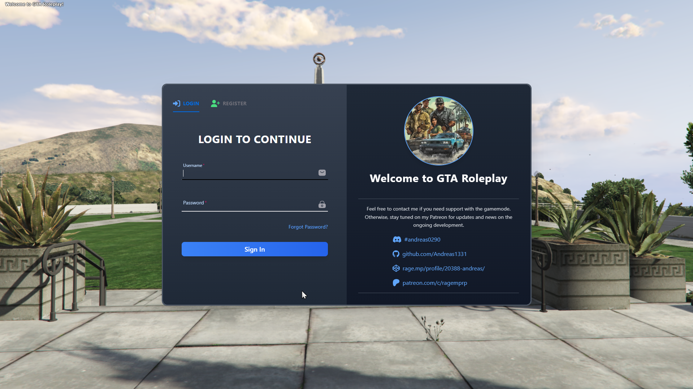

  <h2 align="center">Roleplay Gamemode for RAGE Multiplayer</h2>
  
   
   
  

    The gamemode contains various features and a core foundation in place for expansion. 
     
    <a href="https://www.patreon.com/ragemprp"><strong>Get access</strong></a>
     
    
Disclaimer: This is not affiliated nor endorsed by Take2.

  

<!-- TABLE OF CONTENTS -->

  
Table of Contents

  <ol>
      <li><a href="#get-access">Get Access</a></li>
    <li><a href="#about-the-project">About The Project</a></li>
    <li><a href="#screenshots">Screenshots</a></li>
    <li><a href="#contact">Contact</a></li>
  </ol>

## Get Access
You can get access by subscribing to my Patreon over at:
 
https://www.patreon.com/ragemprp

<!-- ABOUT THE PROJECT -->
## About The Project

After being affiliated with other gaming communities as a developer I decided to try and create my own gamemode from scratch. The plan was however never to start up my own server, but rather release my take on a roleplay gamemode where I could try out things my way. The project is written in C# server-side and JavaScript client-side. 

At the current state the following is implemented:
* Account system with CEF login screen
* Dynamic animation system with proper player positioning
* Character system that allows for as many characters as you wish linked to an account
* Advanced inventory & item system with item bases saved in the database
* Inventory menu using CEF
* Database system utilizing Entity Framework for ORM querying
  * Multiple providers included out of the box (PostgreSQL, MySQL or InMemory)
* Clothing customizer using CEF
* Vehicle tuning using CEF
* System for interacting with any object in the gameworld
  * Workable ATM's with GUI to withdraw money from the bank
  * Every vendingmachine on the map can be interacted with to purchase beverages
* Interactionwheel to interact with objects and perform actions
* Binding server-side actions to keystrokes from clients
* Playable roulette with multiple players
* Supporting localization to easily transfer the bulk text used in the gamemode to any language of your choosing
* and more ...

I originally began development in 2021 and abandoned the project again due to time constraints, and I'm revisiting the project once in a while whenever I have the time for it. Also note that some references to SVG (specifically for item icons) files will be null pointers as the files are removed. This is due to copyright, even though they are free for commercial use I've removed them and you'll have to include your own. 

The setup in Visual Studio abstracts away some of the tedious tasks, such as moving client files written in Javascript into the server folder everytime you wish to test something. This is achieved using post build commands inside Visual Studio to copy the files into wherever you have your server folder located. By default the project is using an InMemory Database Provider for Entity Framework so you do not have to setup any dedicated database to get started. Automation for copying the project after compiling is also done using post build commands, and every dependency is moved to the Rage runtime folder. 

(<a href="#readme-top">back to top</a>)

<!-- SCREENSHOTS -->
## Screenshots

<h3>Login</h3>

<h3>Inventory</h3>

<h3>Clothing customizer</h3>

Character wheel             |  Vehicle wheel
:-------------------------:|:-------------------------:
  |  

<h3>Vehicle customizer</h3>

<h3>General</h3>

Roulette            |  Keypad
:-------------------------:|:-------------------------:
  |  

(<a href="#readme-top">back to top</a>)

<!-- CONTACT -->
## Contact

Discord: andreas0290
 
https://www.patreon.com/ragemprp

(<a href="#readme-top">back to top</a>)

